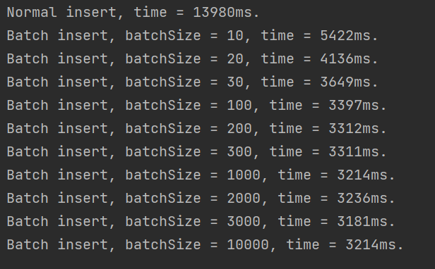
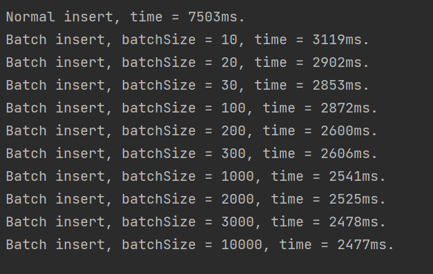
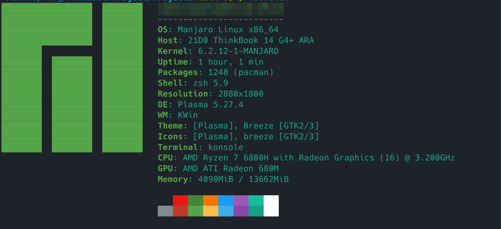
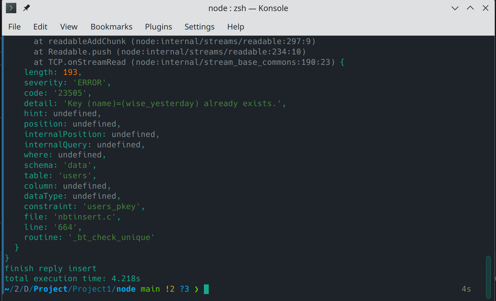

# Project 1
>
>贾禹帆，栾钦策

## ER Diagram


>drew by draw.io

## Database Design


- users: 存储所有用户
  - name 唯一用户名
  - user_id 用户id (身份证号,不存在时为null.为未实名状态)
  - registration_time 注册时间(不存在时按数据导入时间算)
  - phone 手机号
- posts: 存储所有post
  - post_id 唯一id
  - title 标题
  - posting_time post 发布时间
  - author_name post author 用户名
  - city 发布城市
  - country 发布国家
  - content post内容
- replies: 存储所有reply
  - reply_id 自增唯一id
  - post_id 所属post的id
  - stars
  - content reply 内容
- secondary_replies: 存储所有secondary reply
  - secondary_reply_id: 自增唯一id,primary key
  - reply_id: 所属reply的id, foreign key
  - stars
  - content secondary reply 内容
- categories: 存储post类别
  - category 类别名
  - post_id
- follow_relation: 记录用户间关注信息
  - followee_name 被关注者的username
  - follower_name 关注者的username
  - primary key(followee_name,follower_name)
- share_relation: 记录用户分享post信息
  - post_id 分享的post_id
  - user_name 用户名
- favorite_relation: 记录用户favorite post信息
  - post_id favorite的post_id
  - user_name 用户名
- like_relation: 记录用户like post信息
  - post_id like的post_id
  - user_name 用户名

>SQL文件见 `SQL/gen-table.sql`
  
## Data Import

### Basic

#### java

1. java文件结构

- classes
  - Post.java
  - Replies.java
- database
  - DB.java  --数据库的连接，建表，清除表，关闭数据库
  - InsertPost.java  --插入Post
  - InsertReply.java --插入Replies
- Main.java --导入数据
- TestBench.java --导入速度测试
  
2. 数据导入

- 通过Properties文件导入用户信息并连接数据库。
- 通过sql文件`gen-table.sql`， `drop-all.sql`来直接执行建表和清空数据库。

   ```
    public static void genTable() {
        String filePath = "SQL/gen-table.sql";
        exeSqlFile(filePath);
    }
    public static void dropAll() {
        String filePath = "SQL/drop-all.sql";
        exeSqlFile(filePath);
    }
    ```

- 使用全局变量`PreparedStatement stmt`和`Connection con`来进行insert语句的提交。使用统一的`setPreparedStatement(String command)` 来分派插入语句。

    ```
    public static void loadPosts(List<Post> posts) throws SQLException {
        for(Post post: posts){
            setPreparedStatement("insertUser");
            loadInsertUser(post);
            setPreparedStatement("insertPost");
            loadInsertPost(post);
            setPreparedStatement("insertFollow");
            loadInsertFollow(post);
            ...
        }
    }
    ```

- 在插入Second Reply时，需要从数据库中获取自增reply_id，可以用到sql语句`SELECT last_value FROM id_sequence.reply_seq;`

#### node.js

1. 读取 `posts.json` & `replies.json` & `user-info.json` 并解析
2. 打开连接并使用 query 接口插入数据，先插入 post，等待所有 promise 返回后再插入 reply。全部返回后，关闭连接，退出程序。

### Advanced

#### java

- 使用jdbc批处理来加速导入数据。
  - 由于在同一batch中只能用一种PreparedStatement，所以在插入Post类时插入顺序被改为将user/post/follow/... 依次全部插入。
  - 在插入second reply时，由于不能实时获取当前reply的自增id，可以通过维护一个reply的HashSet来获取reply_id。
  - 使用batch插入Replies类时，直接用类里面定义的toSqlString来获取插入语句。
- 不同batch size下的加速效果（设备:AMD Ryzen 7 5800H 16G RAM）
  - 笔记本离电状态下：
  
  - 插电时：  
  
- *分析*：开启批处理后，相较于逐条插入有明显提升，同时随着batch size增加，时间开销逐渐减小，然而加速呈放缓趋势。批处理之所以比逐个插入快，是因为它同时提交多个操作，减少了与数据库服务器之间的通信次数。而在更高的batch size中速度提升不明显，推测原因是数据库自身解析运行sql语句的时间成为了瓶颈。

#### node.js

Optomize:

1. 使用 pool 代替 client 进行多客户端流水线插入。由于数据库操作的原子性，一个操作再完成前不可见。由于node的异步io导致两处地方同时（极短时间内）创建不存在的同一个user触发constrain产生插入异常，属于正常现象，捕获即可。
2. 通过`begin; ... end;` 关闭自动提交来进行批量提交，仅适用于数据较为规范，插入出错较少的情况。一旦出错，需要回滚上次所有批量操作并且全部进行单次插入。(~~要做字符串拼接改的有点多就懒得弄了~~)

测试:

- system info:

- postgres run on docker 23.0.3
- result:


